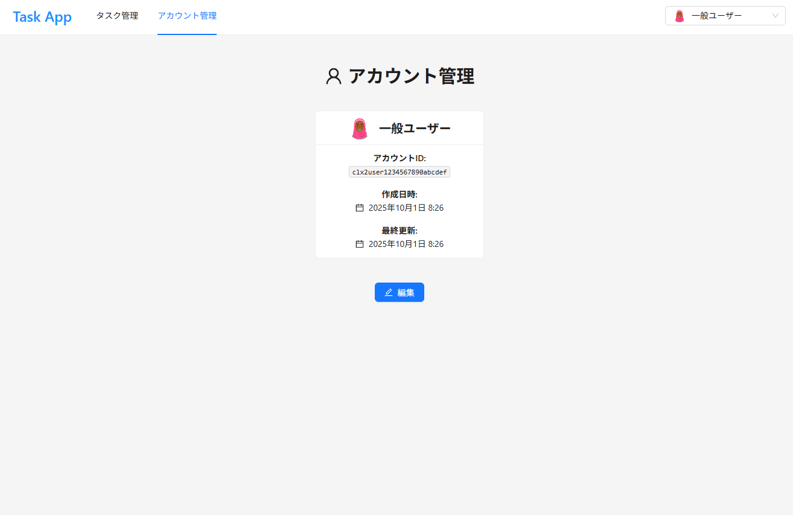
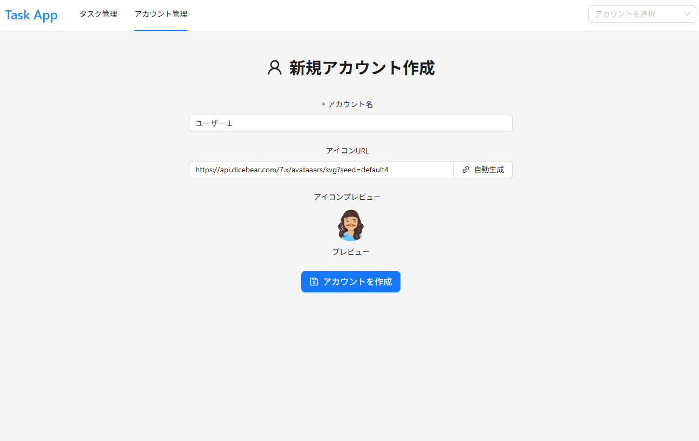

# Template Todo App

[English](./docs/lang/en.md) | 日本語

Next.js/Antd を使用した Todo アプリケーション

## 実装 UI

<div style="display: grid; grid-template-columns: repeat(2, 1fr); gap: 10px;">
    <figure>
        
        <figcaption>タスク管理(/tasks)</figcaption>
    </figure>
    <figure>
        
        <figcaption>アカウント管理(/accounts)</figcaption>
    </figure>
    <figure>
        
        <figcaption>新規アカウント作成(/accounts/new)</figcaption>
    </figure>
</div>

## セットアップ手順

1. リポジトリのクローン

   ```bash
   git clone <repository-url>
   cd template-todo-app
   ```

2. 依存関係のインストール

   ```bash
   pnpm install
   ```

3. 仮想環境および DB のセットアップ

   ```bash
   # DockerでPostgreSQLを起動
   docker compose up -d

   # データベーススキーマの同期
   npx prisma db push

   # サンプルデータの投入
   pnpm db:seed
   ```

4. サーバーの起動

   ```bash
   pnpm dev
   ```

5. 動作確認
   - ブラウザで `http://localhost:3000` にアクセス
   - アカウント管理とタスク管理機能を確認

## API ドキュメント

API のリクエスト/レスポンス・バリデーションルール・エラーレスポンスは zod スキーマから OpenAPI 3.0 仕様書を自動生成しており、人間と AI 双方が読める形式で提供しています。

| 形式 | パス | 用途 |
|---|---|---|
| Scalar UI（対話的）| `http://localhost:3000/api-docs` | 人間がブラウザで閲覧 |
| OpenAPI JSON | `http://localhost:3000/openapi.json`<br>`public/openapi.json` | AI / プログラムから読み込み |
| バリデーション定義書 | [`docs/api/validation.md`](./docs/api/validation.md) | フィールド単位のルール一覧 |
| エラー定義書 | [`docs/api/errors.md`](./docs/api/errors.md) | エラーコードと発生条件 |
| zod スキーマ実装 | `src/lib/validations/*.ts` | 真実の唯一のソース |

### 確認手順

1. dev サーバー起動

   ```bash
   pnpm dev
   ```

2. ブラウザで Scalar UI を開く

   ```
   http://localhost:3000/api-docs
   ```

   左サイドバーから 5 エンドポイント（Tasks / Accounts）と 26 スキーマを対話的に確認できる。「Try it」でリクエスト試行も可能。

3. AI / CLI から仕様を読む例

   ```bash
   # スキーマ一覧
   cat public/openapi.json | jq '.components.schemas | keys'

   # 特定エンドポイントのバリデーション
   cat public/openapi.json | jq '.paths."/tasks".post.requestBody'
   ```

### スキーマ更新時の再生成

zod スキーマ（`src/lib/validations/*.ts`）や API ルートのアノテーションを変更したら、以下を実行：

```bash
pnpm openapi:generate   # public/openapi.json を再生成
```

Scalar UI はブラウザを再読み込みすれば最新の仕様を取得します。

### バリデーションのテスト

```bash
pnpm test src/lib/validations   # zod スキーマのユニットテスト
```
